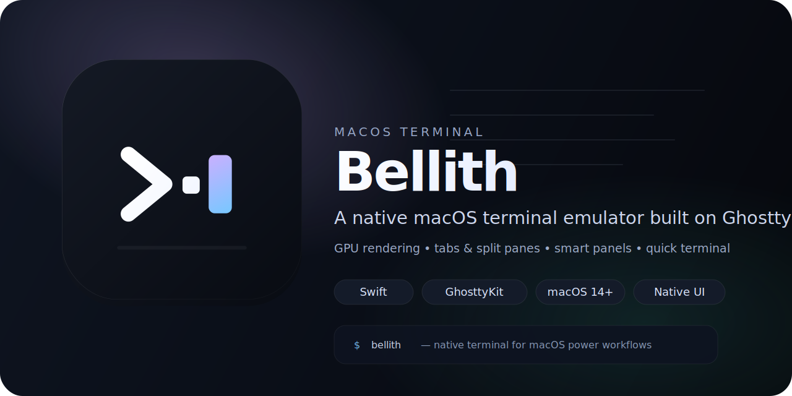

# Bellith

<p align="center">
  
</p>

<p align="center"><strong>A native macOS terminal emulator built with Swift and <a href="https://ghostty.org">Ghostty</a>'s rendering engine.</strong></p>


## Features

- **GPU-accelerated rendering** — Powered by GhosttyKit (Metal-based terminal rendering)
- **Tabs** — Create, close, and switch between multiple terminal tabs
- **Sidebar** — Collapsible sidebar for tab navigation
- **Split panes** — Split your terminal view
- **Command palette** — Quick access to actions via `⌘K`
- **Themes** — Built-in themes including Tokyo Night, Catppuccin Mocha, Gruvbox Dark, Rosé Pine, Nord, and Solarized Dark
- **Preferences** — Configurable settings with persistent storage
- **TERM-aware defaults** — Explicit `xterm-ghostty` advertising with an override for legacy tooling
- **Frameless window** — Clean, minimal window chrome with custom title bar

## Requirements

- macOS 14.0 (Sonoma) or later
- Xcode 16.0+
- [XcodeGen](https://github.com/yonaskolb/XcodeGen)

## Getting Started

### 1. Clone the repository

```bash
git clone git@github.com:RodrigoEspinosa/bellith.git
cd bellith
```

### 2. Generate the Xcode project

```bash
xcodegen generate
```

### 3. Download the GhosttyKit framework

The GhosttyKit XCFramework is distributed as a binary dependency. It will be fetched automatically via Swift Package Manager, or you can place it manually in the `Frameworks/` directory.

### 4. Build & Run

Open `Bellith.xcodeproj` in Xcode and run the **Bellith** target, or use the Makefile:

```bash
make build    # Build the app
make run      # Build and open the app
make clean    # Clean build artifacts
make generate # Regenerate Xcode project from project.yml
```

## Keyboard Shortcuts

| Shortcut | Action |
|---|---|
| `⌘T` | New tab |
| `⌘W` | Close tab |
| `⌘⇧]` | Next tab |
| `⌘⇧[` | Previous tab |
| `⌘C` | Copy |
| `⌘V` | Paste |
| `⌘⇧E` | Toggle sidebar |
| `⌘K` | Command palette |
| `⌘,` | Preferences |

## Terminal Capabilities

Bellith writes Ghostty's `term` setting explicitly and defaults to `xterm-ghostty`. That gives local shells the full Ghostty terminfo entry instead of relying on an implicit runtime default. If a workflow requires a more conservative value such as `xterm-256color`, use `Settings > Terminal > TERM`.

Bellith inherits Ghostty's 24-bit color support. A quick manual check is:

```bash
printf '\033[38;2;255;95;31mTRUECOLOR\033[0m\n'
```

If the sample renders in a bright orange-red instead of a palette approximation, direct RGB color sequences are working.

For SSH sessions, Bellith already enables Ghostty's `ssh-env` compatibility by default. That makes remote connections fall back to `xterm-256color` while propagating compatibility variables. If you also enable `SSH Terminfo Install` in Terminal settings, Ghostty will attempt to install `xterm-ghostty` terminfo remotely so compatible hosts can keep the richer TERM value.

## UI Anatomy

See `docs/window-anatomy.md` for a labeled diagram of the Bellith window and the names for each screen section.

## Project Structure

```
Bellith/
├── App/
│   └── AppDelegate.swift        # App entry point & Ghostty lifecycle
├── Bridge/
│   ├── TerminalApp.swift        # GhosttyKit app wrapper
│   ├── TerminalConfig.swift     # GhosttyKit configuration
│   └── InputHelpers.swift       # Keyboard/mouse input translation
├── Views/
│   ├── TerminalSurfaceView.swift    # Metal-backed terminal surface
│   ├── TerminalContainerView.swift  # Tab & surface management
│   ├── TerminalWindow.swift         # Custom frameless window
│   ├── TabBarView.swift             # Tab bar UI
│   ├── SidebarView.swift            # Sidebar navigation
│   ├── SplitPaneView.swift          # Split pane layout
│   ├── CommandPaletteView.swift     # Command palette overlay
│   ├── PreferencesView.swift        # Preferences window
│   ├── HUDView.swift               # Heads-up display overlay
│   ├── BlurView.swift              # NSVisualEffectView wrapper
│   └── Theme.swift                  # Theme definitions & manager
└── Bellith.entitlements
```

## License

Bellith is released under the [MIT License](./LICENSE).

Bellith bundles [GhosttyKit](https://ghostty.org) for terminal rendering. GhosttyKit is distributed under Ghostty's own (MIT-compatible) license — see the upstream project for details.
