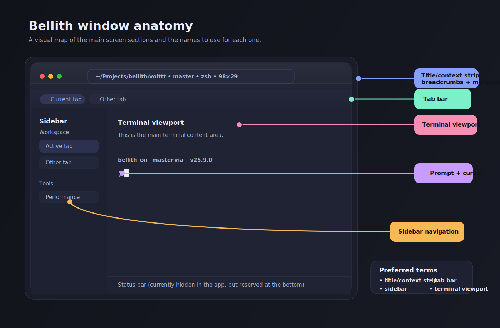
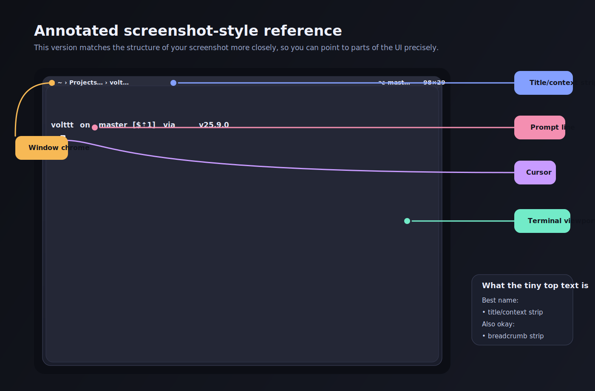

# Bellith Window Anatomy

Use this reference when talking about parts of the main Bellith window.

## Visual diagrams

### Polished layout diagram



### Screenshot-style annotated reference



## Primary layout

```text
┌─────────────────────────────────────────────────────────────────────────────┐
│ Window title bar / top chrome                                              │
│                                                                             │
│  [traffic lights]   [title/context strip]                                  │
│                     path breadcrumbs • git branch • process • terminal size │
├─────────────────────────────────────────────────────────────────────────────┤
│ Tab bar (only shown when sidebar is off and multiple tabs are open)        │
├─────────────────────────────────────────────────────────────────────────────┤
│ Sidebar (optional)   │                                                     │
│ - workspace tabs     │  Terminal content area / terminal viewport          │
│ - tools              │                                                     │
│                      │  Prompt line                                        │
│                      │  > █                                                │
│                      │    └─ cursor / insertion point                      │
│                      │                                                     │
│                      │  Command output / scrollback                        │
│                      │                                                     │
├─────────────────────────────────────────────────────────────────────────────┤
│ Status bar (optional, shown when enabled in Settings > Appearance)         │
└─────────────────────────────────────────────────────────────────────────────┘
```

## Names to use

### Top area
- **window chrome** — the whole framed top area
- **traffic lights** — red / yellow / green window controls
- **title/context strip** — the compact breadcrumb row at the top
- **breadcrumbs** — the path segments inside the title/context strip
- **metadata chips** — git branch, foreground process, terminal size

### Navigation
- **sidebar** — left navigation column
- **workspace section** — tab list inside the sidebar
- **tools section** — smart panels in the sidebar
- **tab bar** — horizontal strip of tabs across the top
- **tab pill** — a single tab in the tab bar

### Main terminal area
- **terminal viewport** — the main visible terminal surface
- **prompt** — the shell input line
- **cursor** — the insertion block/caret
- **scrollback** — previous command output above the prompt
- **split pane** — one terminal pane when the window is split

## For the screenshot you sent

The tiny text you pointed out is the **title/context strip**.

That strip currently shows:
- **path breadcrumbs**
- **git branch**
- **terminal size**

## Short examples

- “The **title/context strip** is too small.”
- “Move the **tab bar** down a little.”
- “The **sidebar workspace section** feels cramped.”
- “The **terminal viewport** needs more top padding.”
- “Make the **prompt** easier to distinguish from scrollback.”
